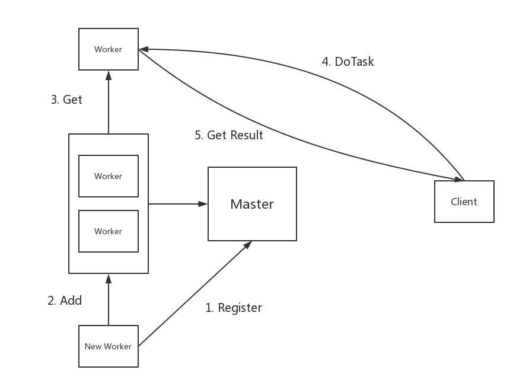

# Lab1: MapReduce

## Part1: Map/Reduce input and output

### doMap()

`doMap()` hashes each key to pick the intermediate file and thus the reduce task that will process the key. There will be `nMap x nReduce` files after all map tasks are done. Each file name contains a prefix, the map task number, and the reduce task number.

### doReduce()

The `doReduce()` for reduce task `r` collects the `r`'th intermediate file from each map task, and calls the reduce function for each key that appears in those files. The reduce tasks produce `nReduce` result files.

## Part2: Single-worker word count

### mapF()

`mapF()` will be passed the name of a file, as well as that file's contents; it should split the contents into words, and return a Go slice of `mapreduce.KeyValue`

### reduceF()

`reduceF()` will be called once for each key, with a slice of all the values generated by `mapF()` for that key. It must return a string containing the total number of occurences of the key.

## Part3: Distributing MapReduce tasks & Part4: Handling worker failures

The master calls `schedule()` twice during a MapReduce job, once for the Map phase, and once for the Reduce phase. `schedule()`'s job is to hand out tasks to the available workers. There will usually be more tasks than worker threads, so `schedule()` must give each worker a sequence of tasks, one at a time. `schedule()` should wait until all tasks have completed, and then return.

## Part5: Inverted index generation

Modify `mapF` and `reduceF` in main/ii.go so that they together produce an inverted index.